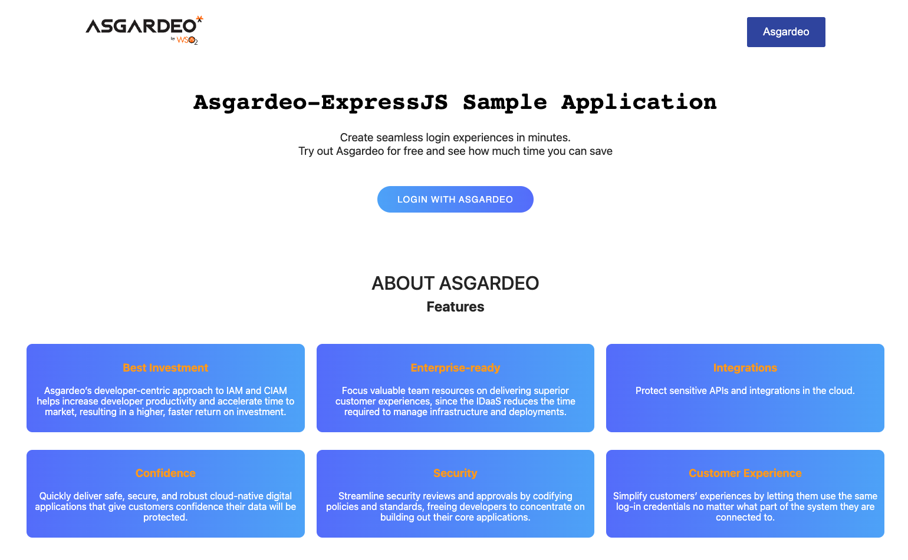
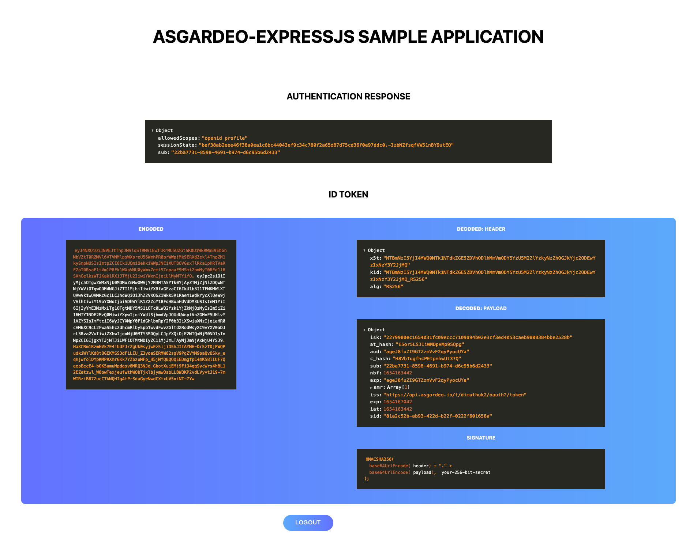

<p align="center">
  
</p>
<p align="center">
  
</p>

## 🚀 Getting started

Clone this repository and do the following inside the project folder:

1. Enter the correct values for the below fields in config.json file.

      ```
      "clientID": "<client_id>",
      "clientSecret": "<client_secret>",
      "baseUrl": "https://api.asgardeo.io/t/<org_name>",
      "appURL": "http://localhost:3000",
      "scope": ["openid", "profile"]
      ```
2. Run `npm i`
3. Run `npm run serve` to start the server with nodeman.

To view the project open `http://localhost:3000`

## 📝 License

This project is licensed under the MIT License - see the [LICENSE.md](LICENSE.md) file for more information.
